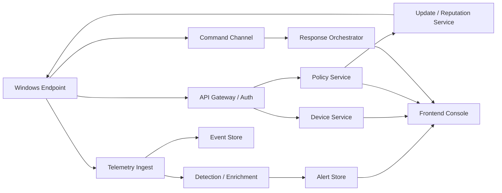

# Architecture

## 1. Architecture Principles

- Default to prevention first, telemetry second, cloud enrichment third.
- Keep the endpoint functional when offline using local cache and queued delivery.
- Start with a modular monolith in the backend to reduce coordination cost, then split services only where scale or isolation demands it.
- Separate high-volume event storage from transactional admin data.
- Make every block, allow, and remediation step explainable.

## 2. High-Level Topology

## 3. Windows Agent Design

### 3.1 Core Components

- `Minifilter driver`
  - Intercepts create/open/write/rename/execute-relevant file activity
  - Sends scan requests and enforcement decisions to the user-mode service
- `Endpoint service`
  - Long-running service that owns policy, scanning, verdicting, telemetry, and response orchestration
  - Planned to move toward protected antimalware service posture
- `AMSI provider`
  - Scans PowerShell, WSH, VBA, and other AMSI-visible content
- `ETW consumers`
  - Collect process, image-load, and selected system events for enrichment
- `WFP integration`
  - Adds network telemetry and later selective connection blocking / isolation logic
- `Updater`
  - Pulls signed engine, policy, reputation, and platform updates
- `Local cache and spool`
  - Stores policy, signatures, reputation, and queued telemetry while offline
- `CLI / shell integration`
  - Supports targeted scan and operational troubleshooting

### 3.2 Detection Pipeline On Endpoint

1. Intercept or observe activity.
2. Normalize into a local canonical event.
3. Evaluate local reputation and trusted allowlists.
4. Run signature, static, and heuristic checks.
5. Correlate with recent process/script/network behavior.
6. Ask cloud reputation or cloud rule service when available.
7. Enforce action and write an explainable decision record.
8. Queue telemetry and optional artefacts for backend upload.

### 3.3 Response Pipeline On Endpoint

- Quarantine malicious files using encrypted local storage and tracked metadata
- Kill malicious process trees
- Remove or revert known artefacts where feasible
- Apply host isolation policy through network controls
- Collect investigation bundles on demand

## 4. Backend Design

### 4.1 Recommended Initial Shape

Start with a modular monolith plus dedicated data services:

- `TypeScript control plane (Fastify in the initial scaffold)`
  - Device registration
  - Auth and session handling
  - Policy/exclusions
  - Response actions
  - Audit log
  - Admin APIs
- `Telemetry ingest service`
  - High-throughput ingestion, validation, batching, and backpressure handling
- `Detection and enrichment workers`
  - Correlation, ATT&CK mapping, reputation enrichment, alert generation
- `Update / reputation service`
  - Signed package metadata, ring rollout, cloud reputation, suppression lists
- `Notification / command service`
  - Pushes response actions and policy deltas to endpoints

### 4.2 Storage Split

- `PostgreSQL`
  - Tenants, devices, policies, exclusions, users, alerts, actions, audit records
- `ClickHouse`
  - High-volume telemetry and timeline queries
- `Object storage`
  - Investigation bundles, uploaded samples, quarantined evidence copies
- `Redis`
  - Caching, rate limits, hot reputation data, short-lived command state

### 4.3 Why Not Full Microservices Yet

- The first risk is endpoint quality, not backend team scaling.
- Alerting, policy, and action workflows will change quickly during early product iterations.
- A modular monolith keeps schema changes, auth, and deployment simpler while the domain settles.

## 5. Frontend Design

### 5.1 Recommended Stack

- Next.js
- React
- TypeScript
- Server-side auth integration with the backend

### 5.2 Primary Views

- Dashboard
- Devices
- Device detail
- Alerts queue
- Alert / investigation detail
- Quarantine
- Policies and exclusions
- Updates and agent health
- Administration, RBAC, and audit

### 5.3 UX Priorities

- Fast triage from alert to process tree to action
- Clear reason codes for every verdict
- Easy rollout rings and exclusion governance
- Minimal clicks for common response actions

## 6. Security Model

- Mutual authentication between agent and backend
- Device identity minted at enrollment
- Signed updates and signed policy bundles where appropriate
- Audit log for all admin and response actions
- Tenant and role isolation in the control plane
- Encrypted artefact storage and scoped download URLs

## 7. Platform-Specific Workstreams

- ELAM driver for early boot posture
- Protected antimalware service requirements
- Windows Security Center registration
- Minifilter altitude request and release management
- AMSI provider registration and compatibility testing
- WFP driver or callout design for telemetry and isolation

## 8. Recommended Tech Choices

| Surface | Choice | Why |
| --- | --- | --- |
| Kernel components | C/C++ with WDK | Lowest platform risk and strongest tooling support |
| Endpoint service | C++ first, optional C# admin tools | Better fit for protected-service and native integrations |
| Backend APIs | Fastify + TypeScript initially | Fast local iteration while the endpoint and data model are still moving quickly |
| Event analytics | ClickHouse | Good fit for large telemetry volumes and timeline search |
| Transactional store | PostgreSQL | Stable relational source of truth |
| Frontend | Next.js + React + TypeScript | Good admin-console ergonomics |

## 9. Delivery Advice

Do not attempt all kernel, script, network, cloud, and response features at once. The right sequence is:

1. Stable endpoint service and update path
2. Minifilter and on-demand scan
3. Backend enrollment, policy, ingest, and alerting
4. AMSI and ETW enrichment
5. WFP, isolation, and investigation actions
6. ELAM, PPL hardening, and advanced behavior analytics
