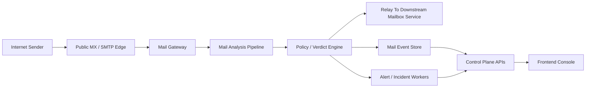

# Email Security Phase A

## 1. Purpose

Phase A adds email as the first major non-endpoint security source in the platform.

The goal is to let the product sit in the inbound mail path using its own MX records, evaluate messages before delivery, and expose the resulting telemetry, verdicts, and actions through the same backend and console that already support endpoint protection.

This phase should be treated as a post-core expansion. It depends on a stable control plane, audit model, RBAC model, storage model, and operator-ready console basics.

## 2. Phase A Goals

- Accept inbound email for customer domains through platform-managed MX infrastructure
- Route mail safely to a downstream mailbox platform such as Microsoft 365 after inspection
- Produce explainable verdicts for connection, sender, message, attachment, and URL risk
- Give analysts searchable message trace, quarantine, and message-detail investigation views
- Reuse the existing control-plane model for policy, actions, auditing, and tenant isolation
- Feed future incident-led correlation with normalized mail events and evidence

## 3. Phase A Non-Goals

- Hosting customer mailboxes
- Replacing Exchange or Microsoft 365 as the mailbox platform
- Outbound filtering in the first release
- Full DLP, encryption, journaling, or eDiscovery workflows
- Full custom detection languages or highly bespoke transport-rule builders
- Fully automated investigation or broad cross-domain correlation
- Complete parity with Microsoft Defender for Office 365

## 4. Recommended First Deployment Topology

The recommended first commercial shape is:

`Internet -> platform MX gateway -> analysis and policy pipeline -> downstream mailbox platform`

For Microsoft 365 customers, the product should behave like a third-party secure email gateway in front of Exchange Online, with careful preservation of sender and authentication context for downstream handling.

## 5. Service Boundaries

### 5.1 `backend/mail-gateway`

Responsibilities:

- SMTP listener and protocol handling
- STARTTLS and TLS policy enforcement
- Recipient-domain lookup and tenant routing
- SMTP acceptance, rejection, deferral, and retry behavior
- Queueing, spool management, and relay to downstream mailbox services
- Header preservation and delivery metadata capture
- Basic connection-level controls such as concurrency limits and abuse throttling

This service should not own long-lived admin policy state. It should consume signed or versioned policy snapshots from the control plane.

### 5.2 `backend/mail-analysis`

Responsibilities:

- MIME parsing and normalization
- Attachment extraction and archive expansion
- URL extraction and normalization
- SPF, DKIM, DMARC, and ARC result recording
- Message, sender, attachment, and URL scoring
- Delivery action selection such as allow, junk, quarantine, reject, or hold
- Evidence packaging for analyst investigation

This service can begin as worker modules in the backend, then split further if performance or blast-radius isolation demands it.

### 5.3 `backend/control-plane`

Responsibilities:

- Tenant, domain, route, and connector configuration
- Mail policy CRUD and versioning
- Quarantine and analyst actions
- Search, trace, and investigation APIs
- Audit log and RBAC enforcement
- Console-facing read models

The current Fastify scaffold remains the correct home for admin APIs and analyst workflows. It is not the right place for public SMTP handling.

### 5.4 Shared Data Services

- `PostgreSQL`
  - domains, connectors, routes, policies, messages, quarantine records, analyst actions, audit
- `ClickHouse`
  - high-volume mail events, delivery pipeline telemetry, search timeline views
- `Object storage`
  - raw MIME, extracted attachments, evidence exports, optional detonation artefacts
- `Redis`
  - queue coordination, rate limits, hot reputation data, short-lived message state

## 6. Core Message Lifecycle

1. Accept SMTP connection on the public MX edge.
2. Identify the tenant and route based on the recipient domain.
3. Apply connection-level controls such as IP reputation, throttling, and protocol validation.
4. Stage the raw message safely for downstream processing.
5. Evaluate sender-authentication results and preserve relevant header context.
6. Parse MIME structure, recipients, attachments, and URLs.
7. Apply policy and baseline verdicting.
8. Choose a delivery action:
   - relay to downstream mailbox service
   - rewrite or tag
   - deliver to junk
   - quarantine
   - hold for additional analysis
   - reject during SMTP
9. Emit normalized events, evidence metadata, and audit records.
10. Expose trace, verdict, and action details through the control plane and console.

## 7. Policy Model

Phase A policy should be use-case based rather than engine-internals based.

Recommended policy families:

- Connection protection
  - TLS requirements, connection throttles, sender reputation thresholds
- Sender authentication
  - SPF, DKIM, DMARC handling, spoof protection posture
- Attachment protection
  - blocked file types, archive depth, malware action, hold-for-analysis action
- URL protection
  - URL extraction, rewriting mode, click-time lookup policy, block lists
- Phishing and impersonation protection
  - display-name abuse, domain lookalike, VIP protection, trusted sender exceptions
- Delivery actions
  - allow, junk, quarantine, hold, reject
- Analyst workflow
  - quarantine retention, release permissions, purge permissions, approval requirements

The first version should favor preset profiles and guarded switches over a huge custom rule language.

## 8. Data Model Additions

These entities should be added without forcing every future alert to be device-centric.

### 8.1 Transactional Entities

#### MailDomain

- `mail_domain_id`
- `tenant_id`
- `domain`
- `status`
- `verification_status`
- `mx_cutover_state`
- `downstream_route_id`
- `created_at`

#### MailRoute

- `mail_route_id`
- `tenant_id`
- `name`
- `downstream_type`
- `downstream_host`
- `downstream_port`
- `tls_mode`
- `connector_reference`
- `enabled`

#### MailPolicy

- `mail_policy_id`
- `tenant_id`
- `name`
- `revision`
- `mode`
- `default_delivery_action`
- `url_rewrite_enabled`
- `attachment_hold_enabled`
- `anti_impersonation_enabled`
- `updated_at`

#### MailRule

- `mail_rule_id`
- `tenant_id`
- `mail_policy_id`
- `priority`
- `name`
- `conditions_json`
- `actions_json`
- `enabled`

#### MailMessage

- `mail_message_id`
- `tenant_id`
- `mail_domain_id`
- `internet_message_id`
- `direction`
- `envelope_from`
- `header_from`
- `subject`
- `received_at`
- `delivered_at`
- `final_action`
- `verdict`
- `policy_id`
- `trace_status`
- `raw_object_key`

#### MailRecipient

- `mail_recipient_id`
- `mail_message_id`
- `recipient_address`
- `delivery_action`
- `delivery_status`
- `downstream_message_id`

#### MailAttachment

- `mail_attachment_id`
- `mail_message_id`
- `file_name`
- `content_type`
- `sha256`
- `size_bytes`
- `archive_depth`
- `verdict`
- `object_key`

#### MailUrl

- `mail_url_id`
- `mail_message_id`
- `original_url`
- `normalized_url`
- `display_text`
- `verdict`
- `rewrite_applied`

#### MailQuarantineItem

- `mail_quarantine_item_id`
- `tenant_id`
- `mail_message_id`
- `scope`
- `reason`
- `status`
- `quarantined_at`
- `release_approved_by`
- `released_at`

#### MailActionRecord

- `mail_action_record_id`
- `tenant_id`
- `mail_message_id`
- `action_type`
- `requested_by`
- `requested_at`
- `status`
- `result_summary`

### 8.2 Event Envelope Additions

Mail events should share the same general envelope pattern used elsewhere, but with mail-native fields.

Recommended canonical fields:

- `tenant_id`
- `mail_message_id`
- `event_id`
- `event_type`
- `occurred_at`
- `ingested_at`
- `direction`
- `recipient_address`
- `sender_address`
- `source_ip`
- `policy_id`
- `action_taken`
- `verdict`
- `raw_json`

Recommended mail event types:

- `mail.connection.accepted`
- `mail.connection.rejected`
- `mail.auth.evaluated`
- `mail.message.parsed`
- `mail.attachment.extracted`
- `mail.url.extracted`
- `mail.policy.matched`
- `mail.delivery.relayed`
- `mail.delivery.quarantined`
- `mail.delivery.rejected`
- `mail.action.released`
- `mail.action.purged`

## 9. API Surface

The mail gateway should use internal service contracts for high-volume processing, while the control plane exposes analyst and admin APIs.

Recommended control-plane API groups:

- `GET /api/v1/mail/dashboard`
- `GET /api/v1/mail/domains`
- `POST /api/v1/mail/domains`
- `GET /api/v1/mail/domains/:mailDomainId`
- `POST /api/v1/mail/domains/:mailDomainId/verify`
- `GET /api/v1/mail/routes`
- `POST /api/v1/mail/routes`
- `GET /api/v1/mail/policies`
- `POST /api/v1/mail/policies`
- `GET /api/v1/mail/messages`
- `GET /api/v1/mail/messages/:mailMessageId`
- `GET /api/v1/mail/quarantine`
- `POST /api/v1/mail/quarantine/:mailQuarantineItemId/release`
- `POST /api/v1/mail/messages/:mailMessageId/purge`
- `GET /api/v1/mail/events`

API design notes:

- Search filters should support domain, sender, recipient, subject, verdict, action, date range, and related incident
- Full raw MIME download should be permission-gated and auditable
- High-volume trace views should read from denormalized query tables instead of assembling data live from raw objects

## 10. Frontend Scope

Phase A should introduce email-specific console surfaces without yet requiring the full incident-led console redesign.

Recommended first pages:

- Email dashboard
  - recent malicious mail count
  - quarantined mail count
  - delivery-action distribution
  - top targeted users
  - top targeted domains
- Message trace
  - searchable list with sender, recipient, subject, verdict, action, and time
- Message detail
  - header summary
  - auth results
  - attachment list and hashes
  - extracted URLs
  - delivery path and action history
- Mail quarantine
  - queued releases, purge actions, and retention state
- Domain health
  - MX readiness, connector health, and downstream relay status

Response actions for the first release:

- release message
- purge message
- block sender
- block domain
- block attachment hash
- block URL
- open related alert

## 11. Delivery Plan Inside Phase A

### A0 - Design, Lab, And Readiness

Goal: remove the biggest architectural and operational unknowns before mail ever touches production traffic.

Deliverables:

- Detailed service contracts for gateway, analysis, and control-plane responsibilities
- Test domains and staging MX environment
- Downstream Microsoft 365 connector and routing runbooks
- Deliverability and abuse test harness
- Retention, privacy, and evidence-handling rules for stored mail artefacts
- Initial schemas and query models for mail trace and quarantine

Exit criteria:

- The team can route staged mail end to end in a lab environment
- The operational model for message retention and analyst access is approved
- The cutover and rollback plan is documented

### A1 - Safe Ingress And Relay

Goal: build a reliable mail path before layering on richer detections.

Deliverables:

- SMTP listener with queueing and retry semantics
- Tenant-aware domain routing
- Downstream relay with delivery-state tracking
- Message trace records for accepted, deferred, rejected, and relayed mail
- Basic connection-level rejection and abuse throttling

Exit criteria:

- Mail flows through the platform reliably in staging
- Operators can trace delivery failures and routing mistakes quickly
- Gateway behavior during downstream outages is predictable

### A2 - Message Parsing, Auth, And Analyst Visibility

Goal: make the mail path explainable and searchable.

Deliverables:

- SPF, DKIM, DMARC, and ARC result capture
- MIME parsing and normalized message, attachment, and URL metadata
- Mail dashboard, message trace, and message-detail pages
- Domain onboarding and health views
- Quarantine workflow primitives and audit logging

Exit criteria:

- Analysts can explain why a message was accepted, quarantined, or rejected
- Mail investigation is possible without needing raw SMTP logs
- Domain onboarding and route state are visible in the console

### A3 - Baseline Protection And Response

Goal: add the first meaningful mail-security verdicts and response actions.

Deliverables:

- Attachment scanning using the existing or extended malware-analysis stack
- Archive handling and blocked-file-type controls
- URL extraction and block-list enforcement
- Baseline phishing and impersonation rules
- Delivery actions for allow, junk, quarantine, reject, and hold
- Analyst actions for release, purge, sender block, domain block, URL block, and attachment-hash block

Exit criteria:

- The platform can catch common malicious attachments and obvious phishing lures
- Analysts can respond to bad mail from one console
- False-positive handling is operationally manageable

### A4 - Hardening And Pilot Readiness

Goal: make the mail platform safe enough for real customer pilots.

Deliverables:

- High-availability deployment model for MX and relay services
- Abuse resistance, queue durability, and failure-recovery drills
- Latency budgets and operational SLOs
- Alerting for gateway backlog, relay failure, and quarantine anomalies
- Deliverability validation and rollback runbook
- Tenant-facing operational documentation

Exit criteria:

- The team can run a controlled pilot without unacceptable mail-delivery risk
- Gateway outages or downstream failures have documented recovery procedures
- Operational support burden is understood before broader rollout

## 12. Dependencies And Risks

Key dependencies:

- Stable multi-tenant control plane and RBAC model
- Searchable event pipeline and retention controls
- Secure secrets handling for downstream relay credentials and certificates
- Malware-safe storage and evidence handling for attachments and raw messages
- Customer-support and operations runbooks

Key risks:

- Mail delivery failures are more commercially damaging than missed endpoint telemetry
- False positives can block business-critical mail
- Raw message storage has privacy, compliance, and retention implications
- URL rewriting and attachment holding can create customer-experience friction
- Deliverability and anti-abuse operations require 24x7 reliability thinking

## 13. Success Measures

- Message trace completeness
- Quarantine and release accuracy
- Median and p95 mail processing latency
- False-positive rate for clean mail
- Detection rate for seeded malicious mail corpora
- Time to understand and act on a suspicious message
- Domain onboarding time for a new tenant

## 14. What Phase A Should Unlock Next

Phase A should leave the platform ready for:

- Expansion Phase B incident-led console work
- Cross-asset correlation between mail, device, and identity events
- Richer Safe Links-like and Safe Attachments-like workflows
- Identity-focused investigation where mail is the initial access vector
